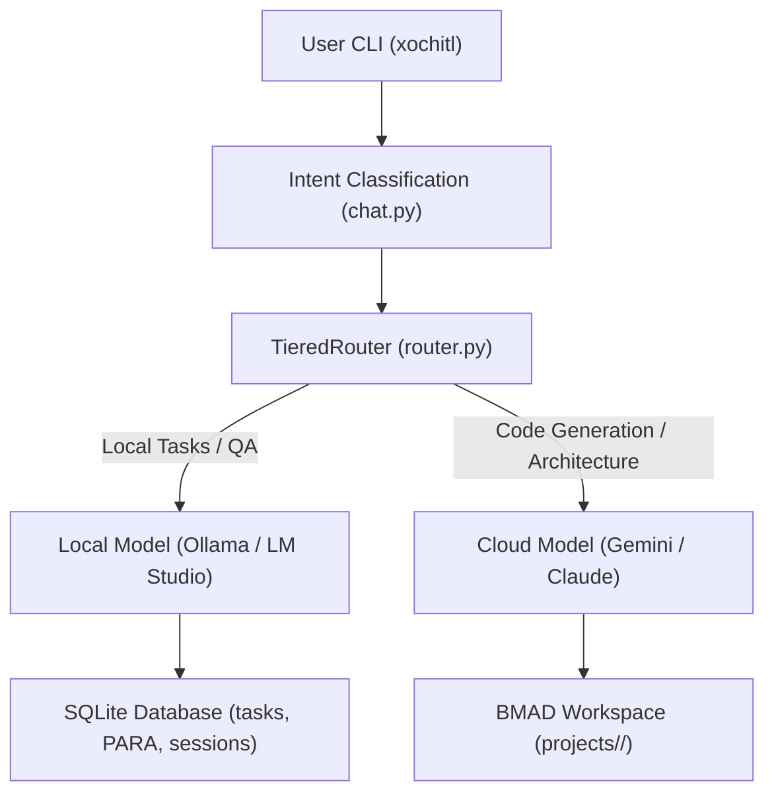

# Xochitl — Product Brief

> **Status:** Draft  
> **Target Audience:** BMAD Development Team & Stakeholders  
> **Owner:** Chief of Staff Assistant  

---

## 1. Executive Summary

**Xochitl** (pronounced *"so-CHEEL"*) is a terminal-native, personality-driven AI Chief of Staff. Operating entirely as a local CLI tool (`xochitl`) on Windows, it serves as a highly capable strategic partner for two distinct but intertwined workflows: **personal project management** and **application development pipelines**.

Xochitl is engineered with a unique local-first design. It routes conversational intent intelligently, handles task lifecycles with strict WIP limits, and provides a guided methodology for creating downstream applications using advanced AI reasoning.

---

## 2. Core Value Propositions & Jobs-To-Be-Done (JTBD)

### Job 1: Proactive Task and Project Management
When I am overwhelmed with goals across multiple projects, **I want Xochitl to seamlessly organize and pull tasks from my PARA-structured Notion**, so that I can maintain a focused local WIP queue capped at exactly 3 items and mark progress without manual overhead.

- **PARA-Notion Sync:** Pulls projects and tasks on demand from Notion; pushes updates upon completion.
- **WIP Constraint:** Forces focus via a strict limit of exactly three active WIP items.

### Job 2: Guided Application Development (BMAD → SDD → Code)
When I want to build a new software application from scratch, **I want Xochitl to lead me through a structured pipeline**, so that my ideas are rigorously evaluated, translated into clear specifications, and scaffolded into high-quality code.

- **BMAD (Stage 1):** Scaffolds Business Model, Architecture, and Design Specs under `projects/<id>/bmad/`.
- **SDD (Stage 2):** Generates Software Design Documents and captures requirements in a traceability matrix (`traceability.json`).
- **Code Generation (Stage 3):** Automatically writes application code under `projects/<id>/src/` with traceable comment links back to original requirements.
- **Issue Tracking (Stage 4):** Analyzes incoming bug reports against specs, categorizes the gap, and provides clear resolution paths.

---

## 3. Persona, Philosophy, and Tone

Xochitl acts not just as an assistant, but as the "Expert Past Me"—a Senior Product Strategist and Chief of Staff. 

- **Reading Level:** Sophisticated but direct (Grade 10–12).
- **Tone:** Professional, strategic, direct, with a warm but slightly cynical sense of humor. 
- **Linguistic Markers:** Drops occasional elementary Spanish phrases naturally (e.g., *Claro*, *Bueno*, *Ay no*).
- **Constraints:** Avoids conversational fluff, em dashes, and typical generic AI transition statements. Only applies frameworks like JTBD or First Principles when specifically requested.

---

## 4. Technical Architecture Overview

The system uses a robust local-first strategy backed by high-capacity cloud fallback to balance speed, cost, and complexity.

### Routing Matrix
- **Local Model:** Handles simple QA, PARA task management, memory recall, and file operations.
- **Local Thinking Model:** Handles code generation and initial code review.
- **Cloud Model:** Ingests complex planning prompts, architecture design, and creative data analysis. Auto-escalates if local models fail twice consecutively.

### System Storage and Security
- **3-Tier Memory:** `MEMORY.md` (active, continuous preference injection), SQLite (conversational sessions & PARA objects), and ChromaDB (long-term semantic vector database).
- **Security Sandboxing:** Enforces safe operational boundaries by forbidding access to high-risk directories (e.g., `C:\Windows`, `~/.ssh`) and strictly requiring user confirmation for writes and deletes.

---

## 5. Strategic Roadmap and Gaps to Address

While the core pipeline of Xochitl is solid, further development will focus on the following key gaps:

### Functional Imperatives
1. **Real-time Synchronization:** Replace pull-on-demand Notion operations with real-time webhooks.
2. **Orchestrator Completeness:** Fleshing out the background autonomous agent loop beyond its current stubbed framework.
3. **Closing the Code Loop:** Developing a feedback loop that parses and analyzes scaffolded code output to correct original specifications.

### UX & Interface Refinements
1. **Streaming Responses:** Implementing streaming capabilities to remove perceptible cloud API latency.
2. **Session Continuity:** Enabling mid-conversation resumes across distinct CLI runs.
3. **Traceability Visualizer:** Surfacing the SQLite and ChromaDB data via in-chat tables and dashboard interfaces.

---

> [!NOTE]
> This Product Brief serves as the foundational artifact for BMad Phase 1 (Analysis and Discovery). Further PRD and SDD scaffolding will extend directly from this document.
